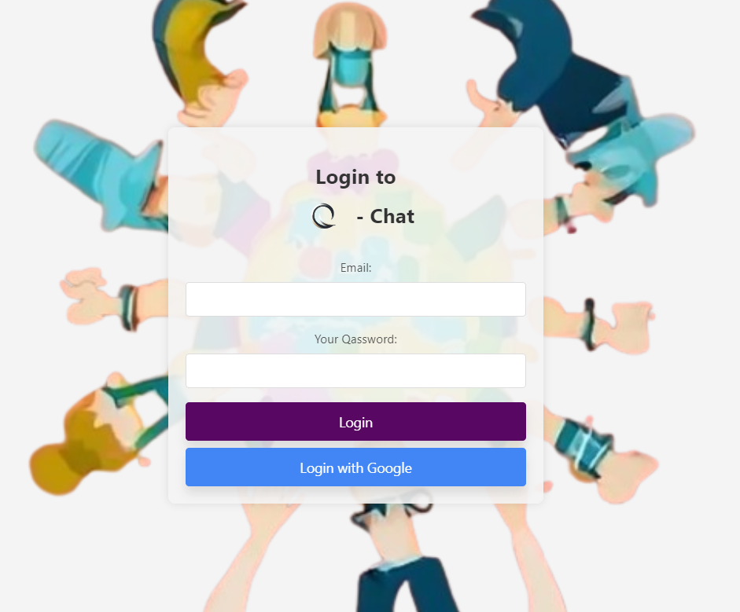
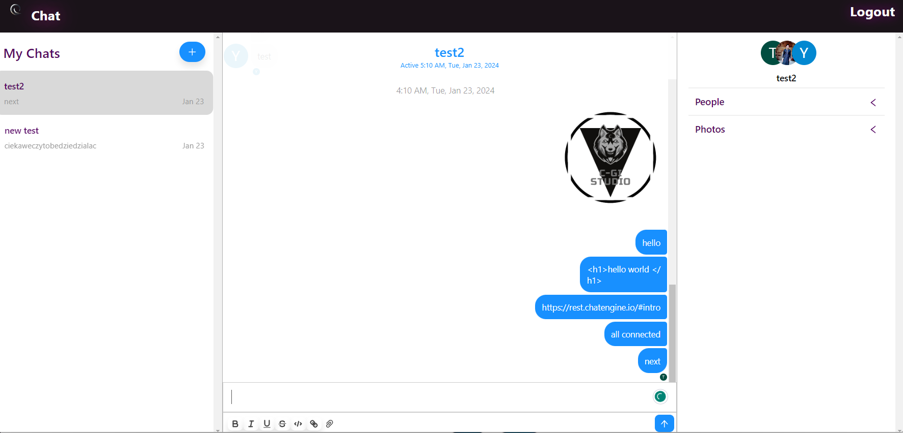

# Q-Chat

Q-Chat is a modern chat application built on technologies like React, Vite, Firebase, and ChatEngine. It provides a user-friendly chat experience with animation effects through integration with the AOS library.

## Introduction

Q-Chat is a simple yet efficient chat system that allows users to communicate in real-time. The application leverages powerful tools such as Firebase for user authentication and data storage, as well as ChatEngine to handle the chat functionality.

## Features

- **Performance and Responsiveness**: Q-Chat is built using Vite, meaning it is efficient and responsive even for large user groups.
- **Secure Authentication**: Firebase handles secure user authentication, ensuring that only logged-in users can use the application.
- **Intuitive User Interface**: A simple and intuitive chat interface makes using Q-Chat easy.
- **AOS Animation Effects**: Animation effects provided by AOS add elegance and an attractive look to the application.

## Getting Started

### Prerequisites

- Node.js
- Firebase project with configuration

### Installation

1. Clone the repository:

    ```bash
    git clone https://github.com/yvonne0711/qchat
    cd q-chat
    ```

2. Install dependencies:

    ```bash
    npm install
    ```

3. Configure the `.env` file based on `.env.example`, providing your Firebase credentials.

4. Run the project:

    ```bash
    npm run dev
    ```

5. The application will be accessible at [http://localhost:5173](http://localhost:5173).

## Firebase Configuration

To configure Firebase, create a project on the [Firebase Console](https://console.firebase.google.com/), then set up the `.env` file according to your Firebase application credentials.

## Additional Resources

- [Vite Documentation](https://vitejs.dev/guide/)
- [Firebase Documentation](https://firebase.google.com/docs)
- [ChatEngine Documentation](https://www.chatengine.io/docs/)


## License

This project is available under the [MIT License](LICENSE).

## Photos 





## Live Demo

## Contributors and Authors

- [@bakomans](https://github.com/bakomans)
- [@yvonne0711](https://github.com/yvonne0711)
- [@SuhaimKhalid](https://github.com/SuhaimKhalid)


